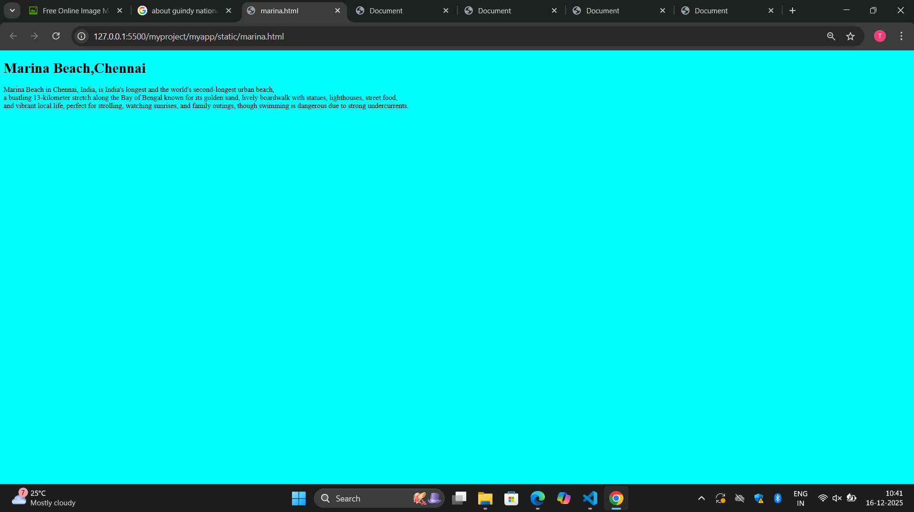
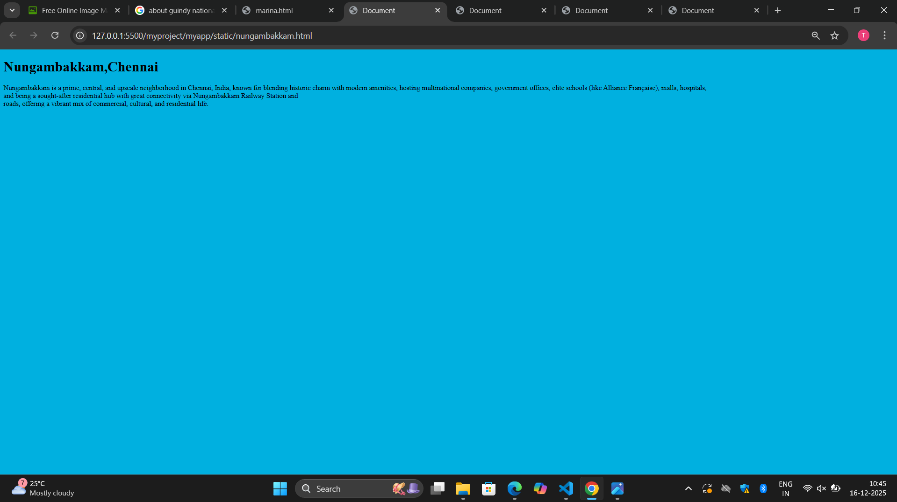
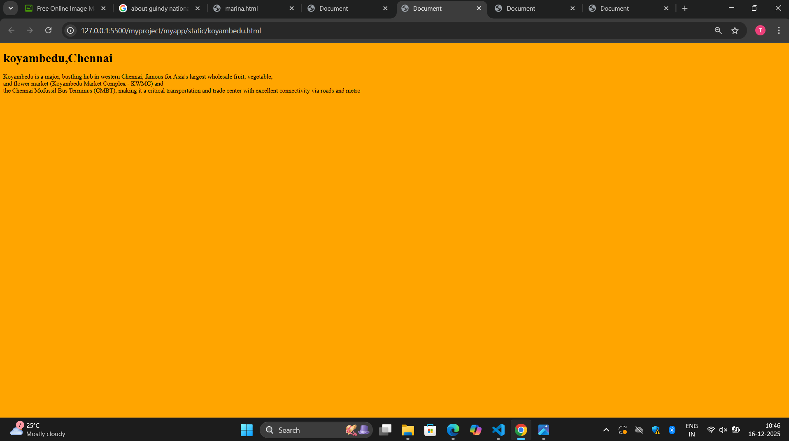
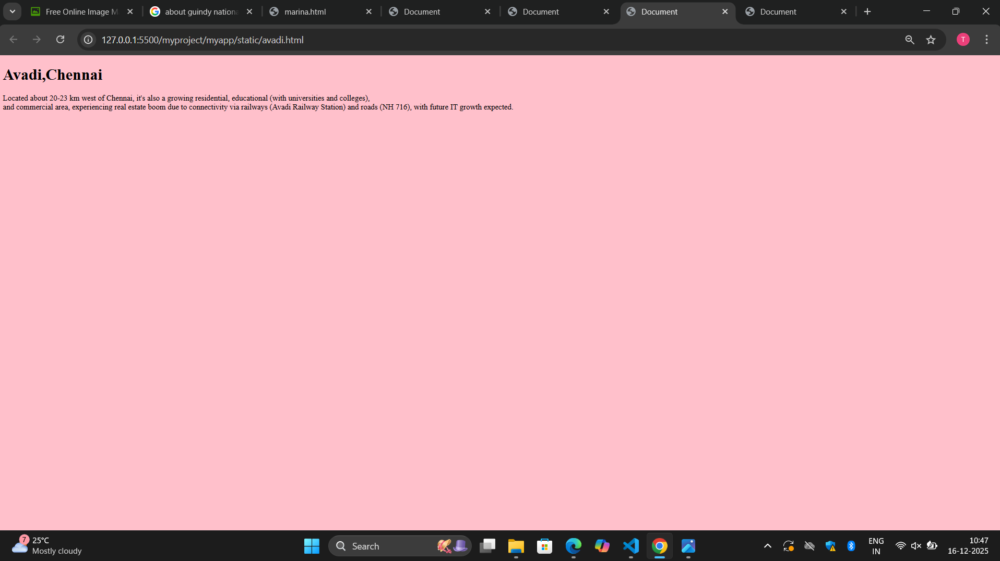
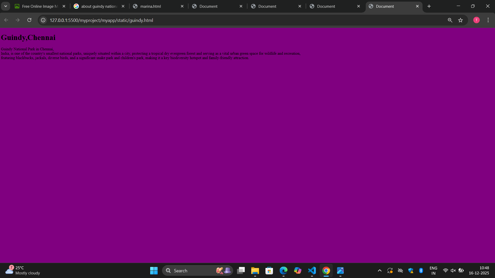

# Ex04 Places Around Me
## Date: 16/12/2025

## AIM
To develop a website to display details about the places around my house.

## DESIGN STEPS

### STEP 1
Create a Django admin interface.

### STEP 2
Download your city map from Google.

### STEP 3
Using ```<map>``` tag name the map.

### STEP 4
Create clickable regions in the image using ```<area>``` tag.

### STEP 5
Write HTML programs for all the regions identified.

### STEP 6
Execute the programs and publish them.

## CODE
<html>
    <head>
        <title>My City</title>
    </head>
    <body>
        <h1 align="center">
            <font color="red"><b>Kanchipuram</b></font>
        </h1>
        <h3 align="center">
            <font color="blue"><b>Viswapriya S(25018876)</b></font>
        </h3>
        <center>
    

 

<map name="image-map">
    <area target="_blank" alt="marina" title="marina" href="marina.html" coords="1540,495,1706,406" shape="rect">
    <area target="_blank" alt="nungambakkam" title="nungambakkam" href="nungambakkam.html" coords="1283,416,127" shape="circle">
    <area target="_blank" alt="koyambedu" title="koyambedu" href="koyambedu.html" coords="993,281,887,321,887,345,967,392,1068,363" shape="poly">
    <area target="_blank" alt="avadi" title="avadi" href="avadi.html" coords="368,213,246,0" shape="rect">
    <area target="_blank" alt="guindy" title="guindy" href="guindy.html" coords="1141,790,66" shape="circle">
</map>
        </center>
    </body>
</html>

<!DOCTYPE html>
<html lang="en">
<head>
    <meta charset="UTF-8">
    <meta name="viewport" content="width=device-width, initial-scale=1.0">
    <title>marina</title>
</head>
<body bgcolor="cyan" >
    <h1>Marina Beach,Chennai</h1>
    <p>Marina Beach in Chennai, India, is India's longest and the world's second-longest urban beach,<br> a bustling 13-kilometer stretch along the Bay of Bengal known for its golden sand, lively boardwalk with statues, lighthouses, street food,<br> and vibrant local life, perfect for strolling, watching sunrises, and family outings, though swimming is dangerous due to strong undercurrents. </p>
    
</body>
</html>

<!DOCTYPE html>
<html lang="en">
<head>
    <meta charset="UTF-8">
    <meta name="viewport" content="width=device-width, initial-scale=1.0">
    <title>Document</title>
</head>
<body bgcolor="sky blue">
    <h1>Nungambakkam,Chennai</h1>
    <p>Nungambakkam is a prime, central, and upscale neighborhood in Chennai, India, known for blending historic charm with modern amenities, hosting multinational companies, government offices, elite schools (like Alliance Française), malls, hospitals,<br> and being a sought-after residential hub with great connectivity via Nungambakkam Railway Station and <br>roads, offering a vibrant mix of commercial, cultural, and residential life. </p>
    
</body>
</html>

<!DOCTYPE html>
<html lang="en">
<head>
    <meta charset="UTF-8">
    <meta name="viewport" content="width=device-width, initial-scale=1.0">
    <title>Document</title>
</head>
<body bgcolor="orange">
    <h1>koyambedu,Chennai</h1>
    <p>Koyambedu is a major, bustling hub in western Chennai, famous for Asia's largest wholesale fruit, vegetable,<br> and flower market (Koyambedu Market Complex - KWMC) and <br>the Chennai Mofussil Bus Terminus (CMBT), making it a critical transportation and trade center with excellent connectivity via roads and metro</p>
    
</body>
</html>

<!DOCTYPE html>
<html lang="en">
<head>
    <meta charset="UTF-8">
    <meta name="viewport" content="width=device-width, initial-scale=1.0">
    <title>Document</title>
</head>
<body bgcolor="pink">
    <h1>Avadi,Chennai</h1>
    <p>Located about 20-23 km west of Chennai, it's also a growing residential, educational (with universities and colleges), <br>and commercial area, experiencing real estate boom due to connectivity via railways (Avadi Railway Station) and roads (NH 716), with future IT growth expected.<br><p>
    
</body>
</html>

<!DOCTYPE html>
<html lang="en">
<head>
    <meta charset="UTF-8">
    <meta name="viewport" content="width=device-width, initial-scale=1.0">
    <title>Document</title>
</head>
<body bgcolor="purple">
    <h1>Guindy,Chennai</h1>
    <p>Guindy National Park in Chennai,<br> India, is one of the country's smallest national parks, uniquely situated within a city, protecting a tropical dry evergreen forest and serving as a vital urban green space for wildlife and recreation,<br> featuring blackbucks, jackals, diverse birds, and a significant snake park and children's park, making it a key biodiversity hotspot and family-friendly attraction. </p>
    
</body>
</html>

## OUTPUT








## RESULT
The program for implementing image maps using HTML is executed successfully.
